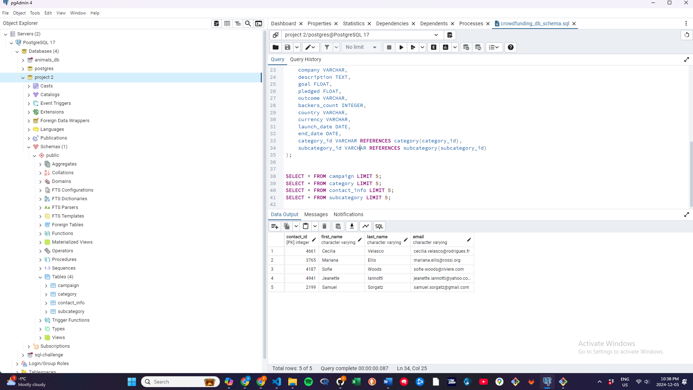

# Crowdfunding_ETL
Project #2 

I had to take the acitivities for the project 12 to achieve this project 2 in all the jupyter notebook, 
for splitting the column from the excel file that was the hardest part i followed this video and of course i did run many diagnostic. 
https://www.youtube.com/watch?v=YaZN_j4I7ls

SQL PART 

Insted of calling crowdfunding_db i named project 2, sorry i couldnt rename it, 

SCHEMA IMPLEMENTED: 

SUBCATEGORUY:
•	subcategory_id (Primary Key)
•	subcategory (VARCHAR)
CATEGORY:
•	category_id (Primary Key)
•	category (VARCHAR)
CONTACT_INFO
•	contact_id (Primary Key)
•	first_name (VARCHAR)
•	last_name (VARCHAR)
•	email (VARCHAR)
CAMPAIGN
•	cf_id (Primary Key)
•	contact_id (Foreign Key from contact_info)
•	company (VARCHAR)
•	description (TEXT)
•	goal (FLOAT)
•	pledged (FLOAT)
•	outcome (VARCHAR)
•	backers_count (INTEGER)
•	country (VARCHAR)
•	currency (VARCHAR)
•	launch_date (DATE)
•	end_date (DATE)
•	category_id (Foreign Key from category)
•	subcategory_id (Foreign Key from subcategory)

CODE USED: HOWEVER I DID CREATED THE TABLES MANUALLY WITH THE DUE PRIMARY KEYS SINCE I THINK IS EASIER,  THEN I MATCHED WITH THIS CODE TO AFTER MANUALLY UPLOAD THE CSV FILE TO EACH FILE, TO CREATE THE DATAFRAME  

CREATE TABLE subcategory (
    subcategory_id VARCHAR PRIMARY KEY,
    subcategory VARCHAR
);

CREATE TABLE category (
    category_id VARCHAR PRIMARY KEY,
    category VARCHAR
);

CREATE TABLE contact_info (
    contact_id INTEGER PRIMARY KEY,
    first_name VARCHAR,
    last_name VARCHAR,
    email VARCHAR
);

CREATE TABLE campaign (
    cf_id INTEGER PRIMARY KEY,
    contact_id INTEGER REFERENCES contact_info(contact_id),
    company VARCHAR,
    description TEXT,
    goal FLOAT,
    pledged FLOAT,
    outcome VARCHAR,
    backers_count INTEGER,
    country VARCHAR,
    currency VARCHAR,
    launch_date DATE,
    end_date DATE,
    category_id VARCHAR REFERENCES category(category_id),
    subcategory_id VARCHAR REFERENCES subcategory(subcategory_id)
);

Verifying each Table contains the info from the CSV file. 

SELECT * FROM campaign LIMIT 5;
SELECT * FROM category LIMIT 5;
SELECT * FROM contact_info LIMIT 5;
SELECT * FROM subcategory LIMIT 5;

Picture with the output as demonstration it did work. 

